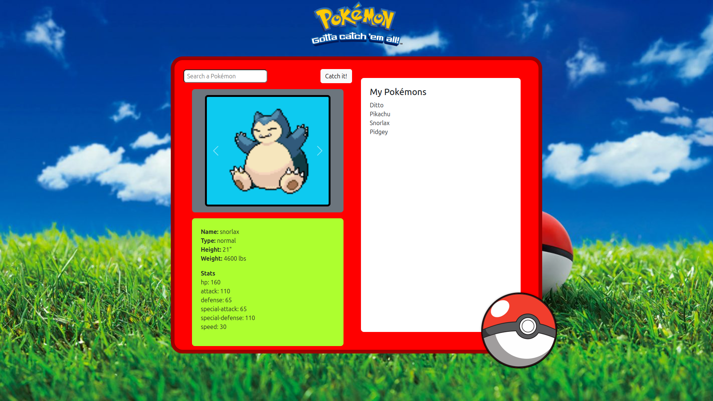
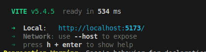

## **Pokémon Catcher**

### **Descrizione**
Questa è un'applicazione Vue.js che simula l'esperienza di catturare Pokémon. L'app permette agli utenti di:

* **Cercare** Pokémon specifici.
* **Visualizzare** i dettagli di un Pokémon catturato, inclusi nome, tipo, statistiche e immagine.
* **Collezionare** i Pokémon catturati in un Pokedex virtuale.

### **Funzionalità Principali**

* **Ricerca Pokémon:** Implementa una funzione di ricerca che permette agli utenti di trovare i Pokémon in base al nome o ad altri criteri.
* **Dettagli Pokémon:** Visualizza le informazioni dettagliate di un Pokémon selezionato, inclusi nome, tipo, statistiche e un'immagine.
* **Salvataggio dei Pokémon:** Salva i Pokémon catturati nel localStorage o in un database (se si utilizza un backend).
* **Pokedex:** Mostra una lista di tutti i Pokémon catturati.

### **Istruzioni per l'utilizzo**

1. **Clona il repository:**
   ```bash
   git clone https://github.com/AleDiBernardo/vue-pokedex.git
   ```
2. **Installa le dipendenze:**
   ```bash
   cd vue-pokedex
   npm i
   ```
3. **Avvia lo sviluppo:**
   ```bash
   npm run dev
   ```
4. **Apri il link:** 


